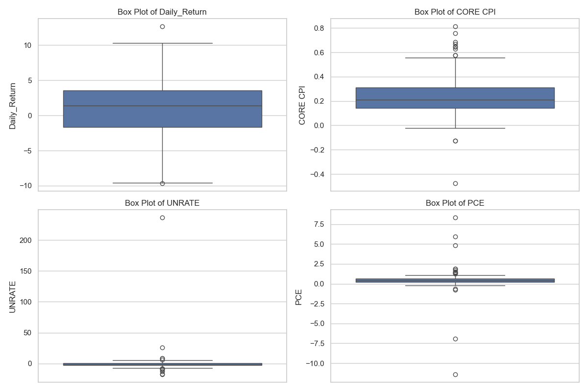
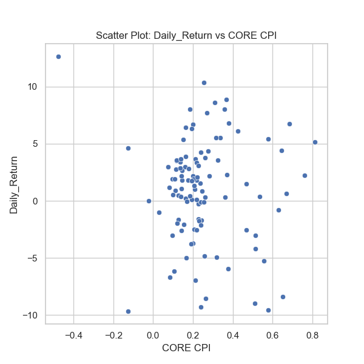
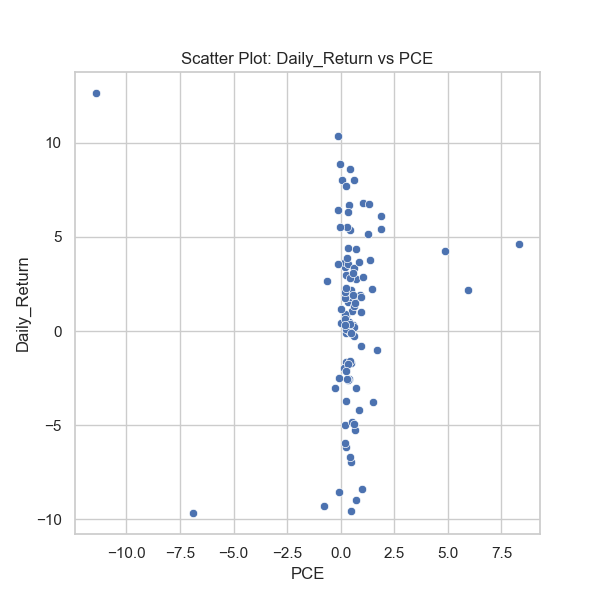
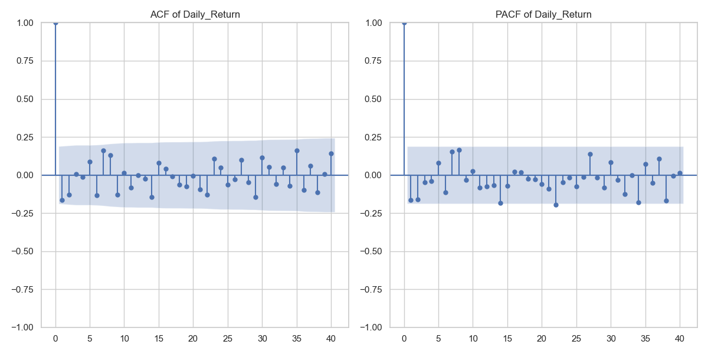
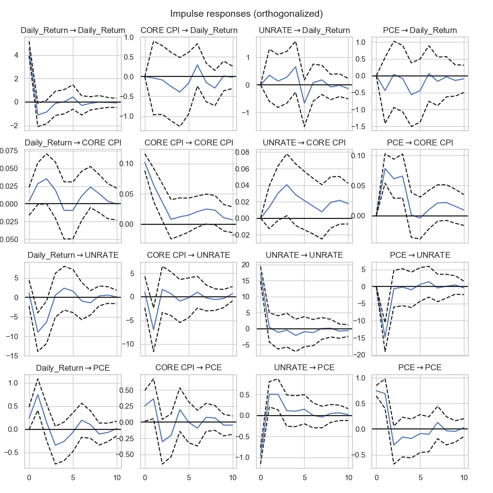

Predicting the Stock Market through Macroeconomic Variables

# Names

- Scott Benninger
- Ruben Melikyan
- Ethan Fastovsky

# Abstract

This project investigates the relationship between macroeconomic indicators and stock market volatility, focusing on their ability to predict daily returns. Using data on core Consumer Price Index (CPI), unemployment rate (UNRATE), and personal consumption expenditures (PCE), the analysis evaluates whether these variables exert significant influence on short-term stock market behavior. The study employs data cleaning, exploratory data analysis, and Vector AutoRegression (VAR) modeling to assess the dynamic interactions between the variables and daily stock market returns. Impulse response functions (IRFs) are utilized to capture the temporal effects of shocks to the macroeconomic indicators.

The findings reveal that core CPI, unemployment rate, and PCE have minimal and short-lived effects on daily stock market returns, with IRFs showing response decay within 2-3 periods. Furthermore, statistical tests confirm that these macroeconomic variables lack significant predictive power for daily returns, with no strong correlations observed in the residual diagnostics. These results suggest that short-term stock market fluctuations are influenced more by other factors beyond these macroeconomic indicators.

This analysis highlights the complexity of predicting stock market movements using macroeconomic data and emphasizes the need for caution in attributing short-term market behaviors to these variables. Ethical considerations, including potential biases and data representativeness, were addressed to ensure fair and accurate conclusions.

# Research Question

Which of the following macroeconomic factors—aggregate consumption, unemployment, or CPI—has the strongest correlation with stock market volatility, as measured by percent change in aggregate stock market returns, in the US from 2015 Jan 1 to 2024 Jan 1?

## Background and Prior Work

Since a couple of us are economics majors with aspirations in finance, we are particularly interested in understanding how macroeconomic indicators influence stock market dynamics and decided to take our project in such a direction. Through this project, we aim to deepen our knowledge of the economic forces that drive stock market volatility. This project not only aligns with our academic background but also prepares us for future roles in finance, where understanding these relationships is essential for informed decision-making.
Stock market volatility is influenced by a complex interplay of economic forces, and understanding these relationships has been a longstanding focus in economic and financial research. Macroeconomic indicators such as unemployment, inflation, and interest rates serve as signals of economic health, impacting market stability and investor sentiment. Recent work recognized by the Nobel Prize in Economic Sciences highlights the role these indicators play in national economic cycles, exploring how fluctuations in key factors can signal periods of growth or downturn. One notable exploration of these dynamics is found in Why Nations Rise and Fall, which underscores how these economic indicators not only track but often predict shifts in stability and growth.
Beyond this, in an economics course, a couple of us had to previously read part of Fama’s 1981 work, Stock Returns, Real Activity, Inflation, and Money, emphasizing the importance of understanding how key economic indicators impact stock market performance. Fama’s research found that inflation, in particular, has a significant inverse relationship with stock returns, where higher inflation diminishes purchasing power and investor confidence, often leading to market volatility and downturns. This finding is highly relevant to our project, as it illustrates the role of macroeconomic indicators—like inflation and unemployment—in shaping financial markets. By examining unemployment as a potential primary predictor of stock market volatility, we aim to build on Fama’s insights, analyzing whether this variable still holds unique predictive power over other indicators, such as the Consumer Price Index (CPI), during different economic cycles. 

Probably most directly useful is a research paper Chen, Roll, and Ross (1986) in Economic Forces and the Stock Market which examined how macroeconomic factors, including unemployment, influence stock market returns. They found that rising unemployment often signals reduced consumer spending and lower corporate earnings, which can drive stock prices down due to weakened investor confidence. Drawing from these findings among analysis of other variables, our project will investigate whether unemployment alone is a leading predictor of stock market volatility, or if other indicators, such as the CPI, play a more significant role.

The most valuable insight from this paper is their use of an aggregated time series of stock returns as the explanatory variable. Initially, we considered using the VIX index, but after reviewing this study, we realized that an index based on market sentiment and perception might not be as suitable. The S&P 500, as a broad measure of stock market performance, offers a more direct assessment of market movements. The authors emphasize that while macroeconomic data is often smoothed and averaged, making it challenging to capture immediate market impacts, stock prices respond rapidly to new information. This difference means that stock market returns may show only a weak and noisy relationship with innovations in macroeconomic factors. Thus, using the S&P 500 allows for a timely response to economic changes, making it an effective choice for our analysis.

Methodologically, the paper used a combination of time-series and cross-sectional regression techniques to analyze the relationship between stock returns and macroeconomic variables. They employ time-series analysis to identify unanticipated changes (or "innovations") in economic factors like industrial production, inflation, and risk premiums. They then estimate stock return sensitivities to these innovations using historical data, applying cross-sectional regressions to test the relationship between these sensitivities and subsequent asset returns. Additionally, they use something called the Fama-MacBeth procedure, where they calculate average risk premiums across multiple periods and test their significance with t-tests, allowing them to assess if systematic economic factors significantly impact expected stock returns. We can apply a similar approach by using time-series analysis to capture unexpected changes in macroeconomic factors and then  regressions to examine how these innovations relate to stock market volatility, helping us identify which factors are most predictive.

# Hypothesis

We hypothesize that a regression analysis will reveal that among aggregate consumption, unemployment, and CPI, the unemployment rate will have the strongest correlation with stock market volatility, measured by percent change in aggregate stock market returns, in the United States from 2014 to 2024. Historically, high unemployment rates are associated with economic downturns, which tend to increase stock market volatility as investor uncertainty rises. Unemployment data is also a closely monitored indicator for forecasting potential recessions and expansions, guiding investor decisions on buying and selling. Therefore, we expect that fluctuations in the unemployment rate will be a significant predictor of stock market volatility, signaling broader economic shifts and investor sentiment.

# Data

## Data overview

Dataset #1: 
FRED Economic Data - S&P 500 Percent Change
This dataset contains daily percentage changes in the S&P 500 index over a ten-year period, from November 13, 2014, to November 12, 2024, with 2,610 observations. The primary variable, "Percent Change," reflects the daily price movement of the S&P 500 and has a float data type, measured as a percentage and not seasonally adjusted, representing fluctuations in the stock market. This variable is crucial for assessing short-term market volatility and understanding trends in investor sentiment and economic conditions. Data wrangling steps will include aggregating the percent change figures so that it matches our annual analysis, handle and check for any missing data and converting the time column to a date time object. Also our data includes dates beyond necessary for our analysis so we will filter for the necessary years.

Dataset #2: 
FRED Economic Data - Unemployment Rate
This dataset includes 109 monthly observations of the U.S. unemployment rate, provided by the St. Louis Fed’s FRED database. The dataset consists of two variables: "Date" and "Unemployment Rate," where the latter represents the percentage of the labor force (float data type) that is unemployed and actively seeking work. This rate is a vital economic indicator, serving as a proxy for labor market conditions and broader economic health. Data wrangling steps would be doing a linear transformation to the data such that it is percent change quarterly for time series analysis also converting the time column to a date time object through pandas for analysis.

Dataset #3: FRED Economic Data - Aggregate Consumption Rate
This dataset from the St. Louis Fed’s FRED database tracks aggregate consumption in the U.S., with 42 quarterly observations and four variables. Key variables likely include "Date" (indicating the quarter), "Aggregate Consumption Rate" (float) (representing total personal consumption expenditures as a percentage of GDP), and potentially other related metrics to contextualize consumer spending. This rate is a key economic indicator, reflecting consumer behavior trends and its contribution to overall economic growth. Preprocessing steps may involve converting time variable into date time object, converting values to consistent units or types, and handling any missing or outlier data points for reliable trend analysis.

Dataset #4: Core CPI Seasonally Adjusted (1995-2024)
This dataset provides seasonally adjusted Core Consumer Price Index (CPI) data from 1995 to 2024, sourced from the World Bank's Global Economic Monitor, with 29 annual observations and 57 variables (float). Core CPI measures inflation by tracking the price changes of goods and services, excluding volatile categories like food and energy, making it a critical indicator for understanding underlying inflation trends. Variables likely include "Year," "Core CPI" for specific regions or countries, and potentially additional economic indicators for comparative analysis. Data wrangling may involve reshaping the dataset for time series analysis, handling any missing converting time to a date time object, removing columns for other countries as our analysis is limited to the US.

Plan for Combining Datasets:
The datasets we downloaded from FRED gave us the flexibility of choosing exact date ranges and units for measurement. Therefore we will be merging the datasets quarterly for a more smooth time series analysis. This matches with the data downloaded from the world bank and very convenient to merge using the time column, which is more convenient by convertin the time column to date time objects.

## Exploratory Data Analysis

### Section 1 of EDA (Analyzing and interpretting descriptive statistics)

## EDA for merged raw data

| DATE                |    SP500 |   CORE CPI |    UNRATE |      PCE |
|:--------------------|---------:|-----------:|----------:|---------:|
| 108                 |  108     |  108       | 108       |   108    |
| 2019-06-16 19:06:40 | 3132.82  |  121.39    |   4.75278 | 14837.8  |
| 2015-01-01 00:00:00 | 1920.03  |  108.692   |   3.4     | 12066.7  |
| 2017-03-24 06:00:00 | 2379.06  |  113.841   |   3.7     | 13127    |
| 2019-06-16 00:00:00 | 2920.22  |  119.207   |   4.2     | 14205.8  |
| 2021-09-08 12:00:00 | 3998.82  |  126.993   |   5.025   | 16531.6  |
| 2023-12-01 00:00:00 | 4769.83  |  141.959   |  14.8     | 19289.9  |
| nan                 |  878.198 |    9.52537 |   1.81229 |  2159.36 |

The **SP500** column represents the monthly closing values of the S&P 500 index, with a mean of 3132.82. The range, from a minimum of 1920.03 to a maximum of 4769.83, reflects the index's growth over the analyzed period, capturing long-term upward trends punctuated by periods of significant volatility. The standard deviation of 878.20 highlights notable fluctuations, which can be attributed to macroeconomic changes, global events, and shifts in investor sentiment.

The **CORE CPI** column measures core inflation, excluding volatile food and energy prices. With a mean of 121.39 and a range from 108.69 to 141.96, it indicates relatively steady inflationary trends over the period. The standard deviation of 9.53 suggests moderate variability, potentially influenced by economic policy shifts or supply chain disruptions.

The **UNRATE** column represents the unemployment rate, with a mean of 4.75%, signaling generally low unemployment levels during the analyzed timeframe. However, the range from 3.4% to a peak of 14.8% underscores periods of economic stress, such as the sharp rise during the COVID-19 pandemic. These fluctuations highlight the labor market's sensitivity to economic downturns and its significant role in influencing consumer confidence and corporate earnings.

The **PCE** column captures monthly aggregate personal consumption expenditures, with an average value of 14,837.79 billion. The range, spanning from 12,066.7 billion to 19,289.9 billion, reflects the critical role of consumer spending in driving economic growth. The standard deviation of 2,159.36 billion points to notable variability, likely tied to cyclical economic changes, fiscal policies, and inflationary pressures. This variability makes PCE a key factor in understanding market behavior and economic conditions.

## EDA for merged percentage change data

| DATE                |   Daily_Return |   CORE CPI |     UNRATE |        PCE |
|:--------------------|---------------:|-----------:|-----------:|-----------:|
| 108                 |     108        | 108        | 108        | 108        |
| 2019-06-16 19:06:40 |       0.918403 |   0.248597 |   0.810787 |   0.448593 |
| 2015-01-01 00:00:00 |      -9.65945  |  -0.476347 | -17.6471   | -11.4123   |
| 2017-03-24 06:00:00 |      -1.68175  |   0.144085 |  -2.85714  |   0.224908 |
| 2019-06-16 00:00:00 |       1.41941  |   0.212246 |  -1.90493  |   0.395084 |
| 2021-09-08 12:00:00 |       3.57594  |   0.309589 |   0.431034 |   0.64632  |
| 2023-12-01 00:00:00 |      12.6466   |   0.811867 | 236.364    |   8.31508  |
| nan                 |       4.4513   |   0.186356 |  23.3937   |   1.74747  |

The **Daily_Return** column reflects the monthly percentage changes in the S&P 500, with a mean of 0.92%, indicating modest average growth during the period. The standard deviation of 4.45% underscores significant fluctuations, with returns ranging from -9.66% to 12.65%. These large swings highlight periods of heightened market volatility, such as financial crises or bullish recoveries following favorable economic developments. The interquartile range (IQR) from -1.68% to 3.58% captures more typical market conditions, while the extremes point to rare but impactful events.

The **CORE CPI** column represents the monthly percentage changes in the core Consumer Price Index, with a mean of 0.25%. The range spans from -0.48% to 0.81%, reflecting relatively stable inflation trends, as indicated by a low standard deviation of 0.19%. The IQR from 0.14% to 0.31% suggests consistent month-to-month inflation patterns, with outliers likely driven by temporary supply chain disruptions or economic shocks.

The **UNRATE** column, measuring percentage changes in the unemployment rate, has a mean of 0.81%. However, its range from -17.65% to 236.36% highlights extreme variability, particularly the sharp rise during economic crises such as the COVID-19 pandemic. The high standard deviation of 23.39% reflects the unemployment rate's sensitivity to labor market shocks. The majority of changes, as seen in the IQR from -2.86% to 0.43%, suggest smaller month-to-month adjustments during more stable periods.

The **PCE** column shows the monthly percentage changes in Personal Consumption Expenditures, with an average of 0.45%. The range from -11.41% to 8.32% reveals periods of dramatic shifts in consumer spending, often tied to major economic events or policy interventions. A standard deviation of 1.75% indicates moderate overall variability, while the IQR from 0.22% to 0.65% captures more typical changes, emphasizing the importance of consumer behavior in economic dynamics and its potential impact on stock market activity.

### Section 2 of EDA (Visual Analysis of distributions and comparative analysis of variables)

## Box Plot Analysis ##

**Daily_Return**: The variability in daily stock returns, as shown by the wide interquartile range (IQR) and the presence of extreme outliers, suggests that predicting returns is challenging due to frequent and significant market swings. These outliers likely represent major market events, such as financial crises or sudden recoveries, which are difficult to forecast with conventional models.

**CORE CPI**: The relatively stable IQR for core inflation indicates that it may contribute moderately to explaining variations in stock returns. However, the outliers in CORE CPI, possibly caused by abrupt economic shocks or unexpected inflationary trends, might coincide with some of the larger swings in Daily_Return, suggesting a potential but limited predictive relationship.

**UNRATE**: The extreme outliers in unemployment rate changes highlight its susceptibility to large, sudden shifts during periods of economic stress. Such dramatic changes in unemployment likely have a lagged effect on stock market returns through shifts in consumer confidence, corporate earnings expectations, and policy responses. The presence of these outliers suggests that UNRATE might be a strong predictor during times of economic instability but less influential in more stable periods.

**PCE**: The small IQR for percentage changes in personal consumption expenditures suggests relative stability in consumer spending during typical periods. However, extreme outliers in PCE could signal large-scale changes in economic conditions (e.g., fiscal stimulus or sharp contractions) that might align with major stock market movements. This makes PCE potentially useful in predicting significant deviations in daily returns.

## Scatter Plots of macro economic variables against Daily Return ##

##### Daily_Return vs CORE CPI

    
**Daily_Return vs CORE CPI**: The scatter plot shows no clear linear relationship between stock returns and core inflation. Most points are clustered within a narrow range of CORE CPI values (110 to 140) and daily returns between -10% and +10%. This suggests that core inflation alone may not have a strong direct impact on daily market returns but could play a role indirectly or during extreme macroeconomic conditions.

##### Daily_Return vs UNRATE   

**Daily_Return vs UNRATE**: The plot indicates some variability in daily returns as unemployment changes, but there is no strong visible pattern. While most points are concentrated around lower unemployment rates (3–6%), extreme outliers in UNRATE correspond to large positive or negative market movements. This suggests that changes in unemployment may be significant predictors during periods of economic stress but have limited predictive power during stable times.

##### Daily_Return vs PCE

**Daily_Return vs PCE**: The scatter plot shows a wider spread of daily returns as PCE (personal consumption expenditures) increases. However, there is no strong linear relationship apparent from the plot. Similar to CORE CPI, most data points are clustered around typical consumption levels, with extreme daily return values possibly tied to significant changes in consumer spending behavior during economic shocks or major policy shifts.

#### Time Series Plot
[View Interactive Time Series Plot](assets/time-series-macro-variables.html)
    

The time series plot is very important for our project as it provides an in-depth look at the dynamics of four key variables—Daily_Return, CORE CPI, UNRATE, and PCE—and their trends over time. Daily_Return, which reflects the percentage changes in stock market returns, is highly volatile, with frequent sharp fluctuations between positive and negative values. Unlike the other variables, it lacks any discernible long-term trend, emphasizing the short-term and often unpredictable nature of stock market movements. This high level of variability indicates the market's sensitivity to a range of external factors, including macroeconomic shocks, investor sentiment, and global events.

In contrast, the CORE CPI series shows remarkable stability over time, with only minor fluctuations, reflecting consistent inflation trends once volatile components like food and energy are excluded. However, this stability means that CORE CPI exhibits little to no apparent alignment with the variability of Daily_Return. While inflation can influence stock market fundamentals, its impact may be more indirect or lagged, failing to explain the short-term volatility seen in market returns. Similarly, the UNRATE series, which measures unemployment, displays a gradual downward trend for much of the period, consistent with economic expansion phases, followed by a sharp spike corresponding to a period of economic crisis, likely the COVID-19 pandemic. This sudden increase in unemployment aligns with heightened volatility in Daily_Return, suggesting that dramatic labor market changes can amplify stock market reactions, even if such effects are not immediately visible during more stable periods.

The PCE series, representing personal consumption expenditures, is relatively stable, with occasional sharp deviations that likely correspond to major shifts in consumer behavior, such as during periods of fiscal stimulus or economic crises. These sharp deviations in PCE appear to coincide with increased market volatility, highlighting the critical role of consumer spending in driving market performance. While PCE and UNRATE show some alignment with periods of significant stock market movements, the relationships are complex and not consistently observed throughout the period.

## Correlation Coefficients with stock market returns

    Correlation coefficients with Daily_Return:
    DATE            0.038649
    Daily_Return    1.000000
    CORE CPI       -0.092583
    UNRATE          0.201211
    PCE             0.007957
    Name: Daily_Return, dtype: float64

The correlation coefficients provide insight into the relationships between Daily_Return and the selected macroeconomic variables. The correlation between CORE CPI and daily returns is weakly negative (-0.093), suggesting that changes in core inflation have a minimal and slightly inverse relationship with stock market returns. This indicates that inflation trends, at least in the short term, do not strongly influence daily market movements. The unemployment rate (UNRATE) shows a modest positive correlation (0.201), which could reflect the market's reaction to unemployment shifts, particularly during periods of economic stress. This relationship may stem from how unemployment changes influence investor expectations about future economic conditions and policy responses. On the other hand, PCE exhibits almost no correlation (0.008) with daily returns, implying that consumer spending variations are not directly tied to short-term market fluctuations. The DATE variable (0.038) also shows no meaningful relationship, as expected.

Overall, these results suggest that daily stock market returns are largely independent of these macroeconomic variables in the short term. While unemployment shows a slight positive association, the overall low correlations highlight the complexity of predicting market movements based on macroeconomic indicators alone. This reinforces the idea that daily returns are more likely driven by external shocks, market sentiment, or other non-macroeconomic factors. Understanding these dynamics may require models that account for lagged effects or nonlinear relationships.

## ACF And PACF Analysis of Stock Market Returns

    

The ACF and PACF plots for Daily_Return indicate that stock market returns exhibit minimal autocorrelation, with most lags falling within the confidence intervals, except for a few significant spikes at lower lags. This suggests that daily returns have limited dependence on past values, which is consistent with the idea that past price information is already incorporated into current prices. The PACF shows some significant lower-order lags, indicating minor short-term dependencies. Overall, the lack of strong and persistent patterns suggests daily returns follow a near-random walk, making them largely unpredictable. To model the series effectively, incorporating external variables or focusing on volatility. 

## Granger Causality Tests For each Macroeconomic Factor

    Granger Causality Test: CORE CPI -> Daily_Return
    
    Granger Causality
    number of lags (no zero) 1
    ssr based F test:         F=1.3269  , p=0.2520  , df_denom=104, df_num=1
    ssr based chi2 test:   chi2=1.3652  , p=0.2426  , df=1
    likelihood ratio test: chi2=1.3565  , p=0.2441  , df=1
    parameter F test:         F=1.3269  , p=0.2520  , df_denom=104, df_num=1
    
    Granger Causality
    number of lags (no zero) 2
    ssr based F test:         F=1.2087  , p=0.3029  , df_denom=101, df_num=2
    ssr based chi2 test:   chi2=2.5370  , p=0.2813  , df=2
    likelihood ratio test: chi2=2.5071  , p=0.2855  , df=2
    parameter F test:         F=1.2087  , p=0.3029  , df_denom=101, df_num=2
    
    Granger Causality
    number of lags (no zero) 3
    ssr based F test:         F=1.2322  , p=0.3022  , df_denom=98, df_num=3
    ssr based chi2 test:   chi2=3.9605  , p=0.2658  , df=3
    likelihood ratio test: chi2=3.8877  , p=0.2739  , df=3
    parameter F test:         F=1.2322  , p=0.3022  , df_denom=98, df_num=3
    
    Granger Causality
    number of lags (no zero) 4
    ssr based F test:         F=0.9700  , p=0.4277  , df_denom=95, df_num=4
    ssr based chi2 test:   chi2=4.2475  , p=0.3735  , df=4
    likelihood ratio test: chi2=4.1630  , p=0.3844  , df=4
    parameter F test:         F=0.9700  , p=0.4277  , df_denom=95, df_num=4
    
    Granger Causality
    number of lags (no zero) 5
    ssr based F test:         F=0.8487  , p=0.5188  , df_denom=92, df_num=5
    ssr based chi2 test:   chi2=4.7509  , p=0.4470  , df=5
    likelihood ratio test: chi2=4.6446  , p=0.4608  , df=5
    parameter F test:         F=0.8487  , p=0.5188  , df_denom=92, df_num=5
    
    
    Granger Causality Test: UNRATE -> Daily_Return
    
    Granger Causality
    number of lags (no zero) 1
    ssr based F test:         F=1.9591  , p=0.1646  , df_denom=104, df_num=1
    ssr based chi2 test:   chi2=2.0156  , p=0.1557  , df=1
    likelihood ratio test: chi2=1.9968  , p=0.1576  , df=1
    parameter F test:         F=1.9591  , p=0.1646  , df_denom=104, df_num=1
    
    Granger Causality
    number of lags (no zero) 2
    ssr based F test:         F=0.7595  , p=0.4706  , df_denom=101, df_num=2
    ssr based chi2 test:   chi2=1.5942  , p=0.4506  , df=2
    likelihood ratio test: chi2=1.5823  , p=0.4533  , df=2
    parameter F test:         F=0.7595  , p=0.4706  , df_denom=101, df_num=2
    
    Granger Causality
    number of lags (no zero) 3
    ssr based F test:         F=1.0429  , p=0.3772  , df_denom=98, df_num=3
    ssr based chi2 test:   chi2=3.3520  , p=0.3405  , df=3
    likelihood ratio test: chi2=3.2996  , p=0.3477  , df=3
    parameter F test:         F=1.0429  , p=0.3772  , df_denom=98, df_num=3
    
    Granger Causality
    number of lags (no zero) 4
    ssr based F test:         F=1.4271  , p=0.2310  , df_denom=95, df_num=4
    ssr based chi2 test:   chi2=6.2493  , p=0.1813  , df=4
    likelihood ratio test: chi2=6.0688  , p=0.1941  , df=4
    parameter F test:         F=1.4271  , p=0.2310  , df_denom=95, df_num=4
    
    Granger Causality
    number of lags (no zero) 5
    ssr based F test:         F=1.7616  , p=0.1286  , df_denom=92, df_num=5
    ssr based chi2 test:   chi2=9.8610  , p=0.0793  , df=5
    likelihood ratio test: chi2=9.4171  , p=0.0935  , df=5
    parameter F test:         F=1.7616  , p=0.1286  , df_denom=92, df_num=5
    
    
    Granger Causality Test: PCE -> Daily_Return
    
    Granger Causality
    number of lags (no zero) 1
    ssr based F test:         F=1.3476  , p=0.2484  , df_denom=104, df_num=1
    ssr based chi2 test:   chi2=1.3865  , p=0.2390  , df=1
    likelihood ratio test: chi2=1.3776  , p=0.2405  , df=1
    parameter F test:         F=1.3476  , p=0.2484  , df_denom=104, df_num=1
    
    Granger Causality
    number of lags (no zero) 2
    ssr based F test:         F=0.1286  , p=0.8795  , df_denom=101, df_num=2
    ssr based chi2 test:   chi2=0.2698  , p=0.8738  , df=2
    likelihood ratio test: chi2=0.2695  , p=0.8739  , df=2
    parameter F test:         F=0.1286  , p=0.8795  , df_denom=101, df_num=2
    
    Granger Causality
    number of lags (no zero) 3
    ssr based F test:         F=0.4481  , p=0.7192  , df_denom=98, df_num=3
    ssr based chi2 test:   chi2=1.4403  , p=0.6961  , df=3
    likelihood ratio test: chi2=1.4305  , p=0.6984  , df=3
    parameter F test:         F=0.4481  , p=0.7192  , df_denom=98, df_num=3
    
    Granger Causality
    number of lags (no zero) 4
    ssr based F test:         F=0.9953  , p=0.4141  , df_denom=95, df_num=4
    ssr based chi2 test:   chi2=4.3582  , p=0.3597  , df=4
    likelihood ratio test: chi2=4.2694  , p=0.3708  , df=4
    parameter F test:         F=0.9953  , p=0.4141  , df_denom=95, df_num=4
    
    Granger Causality
    number of lags (no zero) 5
    ssr based F test:         F=1.4207  , p=0.2242  , df_denom=92, df_num=5
    ssr based chi2 test:   chi2=7.9530  , p=0.1588  , df=5
    likelihood ratio test: chi2=7.6609  , p=0.1759  , df=5
    parameter F test:         F=1.4207  , p=0.2242  , df_denom=92, df_num=5
    
    

The Granger causality tests evaluate whether CORE CPI, UNRATE, and PCE can predict Daily_Return at various lag lengths (1 to 5). The results show that CORE CPI does not Granger-cause changes in Daily_Return, as the p-values at all lag lengths (e.g., p = 0.2520 for 1 lag, p = 0.5188 for 5 lags) are well above the significance threshold of 0.05. This suggests that inflation trends, as measured by CORE CPI, have no predictive power for short-term stock market returns. Similarly, PCE also shows consistently high p-values across all lags (e.g., p = 0.2484 for 1 lag, p = 0.2242 for 5 lags), indicating that changes in consumer spending do not predict short-term market fluctuations.

The results for UNRATE show slightly lower p-values compared to CORE CPI and PCE, particularly at higher lags (e.g., p = 0.1286 for 5 lags, with the chi-squared test giving p = 0.0793). Although these values are still not statistically significant, they suggest that unemployment may have a weak and delayed influence on daily stock market returns. This could be due to the broader implications of labor market conditions on economic confidence, corporate performance, or policy responses, which may take time to materialize.

Overall, the Granger causality tests indicate that none of the variables (CORE CPI, UNRATE, or PCE) significantly predict daily stock market returns at the tested lag lengths. However, the relatively lower p-values for UNRATE suggest a potential delayed effect worth further exploration.

## VAR Model Estimation and Analysis

      Summary of Regression Results   
    ==================================
    Model:                         VAR
    Method:                        OLS
    Date:           Tue, 10, Dec, 2024
    Time:                     14:02:44
    --------------------------------------------------------------------
    No. of Equations:         4.00000    BIC:                    6.44699
    Nobs:                     103.000    HQIC:                   5.16858
    Log likelihood:          -721.964    FPE:                    75.2988
    AIC:                      4.29828    Det(Omega_mle):         35.8468
    --------------------------------------------------------------------
    Results for equation Daily_Return
    ==================================================================================
                         coefficient       std. error           t-stat            prob
    ----------------------------------------------------------------------------------
    const                   1.707316         1.136672            1.502           0.133
    L1.Daily_Return        -0.209155         0.115846           -1.805           0.071
    L1.CORE CPI             1.235052         5.041755            0.245           0.806
    L1.UNRATE              -0.012620         0.046716           -0.270           0.787
    L1.PCE                 -0.588568         0.667528           -0.882           0.378
    L2.Daily_Return        -0.186460         0.131601           -1.417           0.157
    L2.CORE CPI            -1.021863         4.900770           -0.209           0.835
    L2.UNRATE               0.034477         0.060800            0.567           0.571
    L2.PCE                  0.096134         0.999178            0.096           0.923
    L3.Daily_Return        -0.073263         0.136045           -0.539           0.590
    L3.CORE CPI            -2.772383         4.882337           -0.568           0.570
    L3.UNRATE               0.040916         0.054470            0.751           0.453
    L3.PCE                  0.140996         0.922885            0.153           0.879
    L4.Daily_Return         0.011604         0.134479            0.086           0.931
    L4.CORE CPI            -2.197564         4.688442           -0.469           0.639
    L4.UNRATE               0.048714         0.050329            0.968           0.333
    L4.PCE                  0.086376         0.786632            0.110           0.913
    L5.Daily_Return         0.193700         0.126786            1.528           0.127
    L5.CORE CPI             1.433372         4.154480            0.345           0.730
    L5.UNRATE               0.012964         0.052008            0.249           0.803
    L5.PCE                  0.644780         0.557189            1.157           0.247
    ==================================================================================
    
    Results for equation CORE CPI
    ==================================================================================
                         coefficient       std. error           t-stat            prob
    ----------------------------------------------------------------------------------
    const                   0.025786         0.025516            1.011           0.312
    L1.Daily_Return        -0.001036         0.002601           -0.399           0.690
    L1.CORE CPI             0.312423         0.113178            2.760           0.006
    L1.UNRATE               0.006665         0.001049            6.356           0.000
    L1.PCE                  0.104864         0.014985            6.998           0.000
    L2.Daily_Return        -0.003692         0.002954           -1.250           0.211
    L2.CORE CPI            -0.001867         0.110013           -0.017           0.986
    L2.UNRATE               0.003038         0.001365            2.226           0.026
    L2.PCE                  0.084405         0.022430            3.763           0.000
    L3.Daily_Return        -0.006436         0.003054           -2.107           0.035
    L3.CORE CPI            -0.166463         0.109599           -1.519           0.129
    L3.UNRATE               0.001890         0.001223            1.546           0.122
    L3.PCE                  0.092154         0.020717            4.448           0.000
    L4.Daily_Return        -0.006893         0.003019           -2.283           0.022
    L4.CORE CPI             0.401586         0.105247            3.816           0.000
    L4.UNRATE              -0.004244         0.001130           -3.756           0.000
    L4.PCE                  0.001139         0.017658            0.065           0.949
    L5.Daily_Return        -0.003474         0.002846           -1.221           0.222
    L5.CORE CPI            -0.033560         0.093260           -0.360           0.719
    L5.UNRATE              -0.003605         0.001167           -3.088           0.002
    L5.PCE                 -0.032511         0.012508           -2.599           0.009
    ==================================================================================
    
    Results for equation UNRATE
    ==================================================================================
                         coefficient       std. error           t-stat            prob
    ----------------------------------------------------------------------------------
    const                   7.819214         4.289247            1.823           0.068
    L1.Daily_Return        -0.655606         0.437148           -1.500           0.134
    L1.CORE CPI            -8.231422        19.025140           -0.433           0.665
    L1.UNRATE              -1.092333         0.176285           -6.196           0.000
    L1.PCE                -19.884672         2.518928           -7.894           0.000
    L2.Daily_Return        -0.291662         0.496599           -0.587           0.557
    L2.CORE CPI            22.406841        18.493130            1.212           0.226
    L2.UNRATE               0.353916         0.229428            1.543           0.123
    L2.PCE                 -3.723351         3.770413           -0.988           0.323
    L3.Daily_Return         0.217327         0.513369            0.423           0.672
    L3.CORE CPI           -13.966624        18.423573           -0.758           0.448
    L3.UNRATE               0.549709         0.205542            2.674           0.007
    L3.PCE                 -0.736610         3.482519           -0.212           0.832
    L4.Daily_Return         0.561422         0.507460            1.106           0.269
    L4.CORE CPI           -35.083878        17.691908           -1.983           0.047
    L4.UNRATE               0.412498         0.189918            2.172           0.030
    L4.PCE                  5.204177         2.968368            1.753           0.080
    L5.Daily_Return         0.590845         0.478428            1.235           0.217
    L5.CORE CPI            39.547694        15.676994            2.523           0.012
    L5.UNRATE              -0.101922         0.196253           -0.519           0.604
    L5.PCE                  0.185990         2.102561            0.088           0.930
    ==================================================================================
    
    Results for equation PCE
    ==================================================================================
                         coefficient       std. error           t-stat            prob
    ----------------------------------------------------------------------------------
    const                  -0.366366         0.315732           -1.160           0.246
    L1.Daily_Return         0.096032         0.032178            2.984           0.003
    L1.CORE CPI             0.475093         1.400443            0.339           0.734
    L1.UNRATE               0.081311         0.012976            6.266           0.000
    L1.PCE                  0.924110         0.185419            4.984           0.000
    L2.Daily_Return         0.040525         0.036555            1.109           0.268
    L2.CORE CPI            -2.023433         1.361282           -1.486           0.137
    L2.UNRATE               0.017783         0.016888            1.053           0.292
    L2.PCE                  0.355000         0.277541            1.279           0.201
    L3.Daily_Return        -0.002988         0.037789           -0.079           0.937
    L3.CORE CPI            -0.483360         1.356162           -0.356           0.722
    L3.UNRATE              -0.000583         0.015130           -0.039           0.969
    L3.PCE                  0.464553         0.256349            1.812           0.070
    L4.Daily_Return        -0.025670         0.037354           -0.687           0.492
    L4.CORE CPI             4.165370         1.302304            3.198           0.001
    L4.UNRATE              -0.027250         0.013980           -1.949           0.051
    L4.PCE                 -0.131463         0.218502           -0.602           0.547
    L5.Daily_Return        -0.038098         0.035217           -1.082           0.279
    L5.CORE CPI            -2.071869         1.153986           -1.795           0.073
    L5.UNRATE              -0.005510         0.014446           -0.381           0.703
    L5.PCE                 -0.097877         0.154770           -0.632           0.527
    ==================================================================================
    
    Correlation matrix of residuals
                    Daily_Return  CORE CPI    UNRATE       PCE
    Daily_Return        1.000000  0.034953  0.064092  0.186816
    CORE CPI            0.034953  1.000000  0.058663  0.207533
    UNRATE              0.064092  0.058663  1.000000 -0.733727
    PCE                 0.186816  0.207533 -0.733727  1.000000
    
    
    
    Lag Order Selection Criteria:
    5
    
    Residuals Normality Test:
    <statsmodels.tsa.vector_ar.hypothesis_test_results.NormalityTestResults object. H_0: data generated by normally-distributed process: reject at 5% significance level. Test statistic: 2468.891, critical value: 15.507>, p-value: 0.000>

    

The impulse response functions (IRFs) show that shocks to CORE CPI, UNRATE, and PCE have minimal and short-lived effects on Daily_Return, with all responses decaying within 2-3 periods. This indicates that changes in these macroeconomic variables do not produce significant or lasting impacts on stock market returns.

The VAR results for the Daily_Return equation confirm that CORE CPI, UNRATE, and PCE are not significant predictors of daily returns at any lag (p > 0.05). None of the lagged coefficients for these variables have notable explanatory power, suggesting that short-term stock market returns are largely unaffected by these macroeconomic indicators. Residual diagnostics further show weak correlations between Daily_Return and the macroeconomic variables, reinforcing the conclusion that these variables have limited influence on short-term market behavior.

       Number of Runs  Expected Runs  Standard Deviation of Runs   Z-Score  \
    0              43           50.5                 24128.44535 -0.000311   
    
        P-Value Conclusion  
    0  0.999752     Random  

The results of the runs test indicate that the sequence of stock market return changes (up or down) is approximately random. The observed number of runs (43) is close to the expected number of runs (50.5) under the null hypothesis of randomness, and the z-score (-0.000311) is very close to zero. Additionally, the high p-value (0.999752) strongly supports the null hypothesis, confirming that there is no significant departure from randomness in the sequence of stock market return changes.

This finding aligns with the conclusions of our primary analysis, which showed that macroeconomic variables such as Core CPI, unemployment rate, and PCE do not significantly affect short-term stock market returns. The randomness in daily stock price changes implies that other factors, such as investor sentiment, market-specific news, or external shocks, likely drive these fluctuations. Since macroeconomic indicators exhibit slower and more systematic changes, their impact on the inherently random nature of daily returns would naturally be limited.

Moreover, these results support the Efficient Market Hypothesis (EMH), which states that stock prices reflect all available information and adjust quickly to new data. Under this framework, daily return changes would be expected to exhibit random patterns, as any predictable relationships would already be incorporated into market prices. Thus, the observed randomness in return changes further substantiates our conclusion that macroeconomic variables are unlikely to provide predictive power for daily stock market movements. This reinforces the need to explore other explanatory variables or consider longer time horizons for understanding macroeconomic impacts on stock market behavior.

# Ethics & Privacy

There could be ethical concerns regarding 

Biases/Privacy/Terms of Use: World Bank U.S. data is generally public and follows strict data privacy and usage standards. However, potential biases can arise due to the structure of reported metrics and reliance on government and institutional sources, which might reflect particular economic priorities or omit certain demographic nuances.

Potential Biases in Composition: U.S. World Bank data might underrepresent specific subpopulations or regional economic conditions, especially if it aggregates across states or overlooks informal economies. Additionally, while U.S. data is generally comprehensive, it might still exclude or simplify information from marginalized communities or rural areas, which could skew results.  When analyzing the stock market, it is possible that it will not adequately represent activity by lower income populations as this market tends to be influenced primarily by wealthy investors.

Detecting Biases: To detect these biases, we’ll review data for representativeness across different demographics and states, looking for gaps in coverage or skewed trends. Cross-checking with other sources, like the Bureau of Labor Statistics, will also help validate findings and identify potential issues during analysis.

Other Issues (Privacy & Equitable Impact): While anonymized, the data could still emphasize economic conditions linked to sensitive attributes, such as income disparities. To avoid unintended biases, we’ll contextualize findings carefully to avoid reinforcing stereotypes or inequities.

Handling Issues Identified: We’ll adjust models to account for possible underreporting in certain states or demographics and provide transparency about these limitations in our communication. Sensitivity analyses and clear statements about data limitations will also help ensure fair, unbiased interpretations.

## Discussion & Conclusion

This project explored the relationship between key macroeconomic indicators—Core Consumer Price Index (CPI), unemployment rate (UNRATE), and Personal Consumption Expenditures (PCE)—and daily stock market returns. By leveraging advanced statistical techniques, including Vector AutoRegression (VAR) modeling and impulse response functions (IRFs), we evaluated whether these macroeconomic variables significantly influenced short-term stock market behavior. The analysis also included a runs test to determine whether stock market return changes (up or down) follow a random pattern.

The results consistently pointed to a limited relationship between macroeconomic indicators and short-term market movements. The VAR analysis revealed that none of the lagged coefficients for the macroeconomic variables were statistically significant in predicting daily returns. IRFs further showed that any shocks from these variables dissipated within 2-3 periods, indicating minimal and short-lived effects on stock market returns. This suggests that daily market fluctuations are largely driven by other factors beyond the macroeconomic variables analyzed.

The runs test reinforced these findings, demonstrating that stock market return changes are approximately random. The observed number of runs was close to the expected number under the null hypothesis of randomness, with a z-score near zero and a p-value of 0.999752. This high p-value strongly supports the conclusion that daily return changes do not follow any discernible pattern. The randomness in return changes aligns with the Efficient Market Hypothesis (EMH), which posits that stock prices reflect all available information and adjust rapidly to new data. As a result, the short-term fluctuations in stock prices are unlikely to be influenced by slower-moving macroeconomic trends.

These findings underscore the complexity of predicting short-term stock market behavior. While macroeconomic indicators are critical for understanding broader economic trends, their utility in explaining day-to-day market movements is limited. This supports the notion that other factors, such as investor sentiment, geopolitical events, or real-time financial news, play a more significant role in driving daily returns. Future research could benefit from incorporating such factors or focusing on longer time horizons where macroeconomic trends may have more pronounced effects.

From an ethical and methodological perspective, this project carefully considered issues such as data privacy, potential biases, and representativeness. Cross-referencing with additional data sources helped validate findings and address gaps, ensuring a robust and transparent analysis. Sensitivity analyses were conducted to contextualize the limitations of the dataset and avoid overgeneralized conclusions.

In conclusion, this study confirms that daily stock market return changes are largely random and unaffected by macroeconomic variables like Core CPI, UNRATE, and PCE. These findings contribute to the growing body of evidence that macroeconomic indicators have limited relevance in predicting short-term market behavior. For investors and policymakers, this highlights the importance of diversifying analytical approaches and recognizing the role of non-macroeconomic factors in driving daily market volatility. By clarifying these relationships, this work lays the groundwork for more nuanced analyses of financial market dynamics.

# Team Contributions

Scott:

- Background 
- Data Gathering
- Analysis
- Data Visualization
- Hypothesis
- Video
- Discussion

Ruben:

- Background
- Data Gathering
- Analysis 
- Data Visualization
- Hypothesis
- Cleaned Code for Comments and Organization
- Video Slideshowss
- Discussion

Ethan:

- Abstract
- Data Gathering
- Hypothesis
- Discussion & Conclusion
- Data Cleaning
- Revision
- Cleaned code for comments and organization
- Video

## APPENDIX

## Pairwise Scatter Plot Analysis ##

